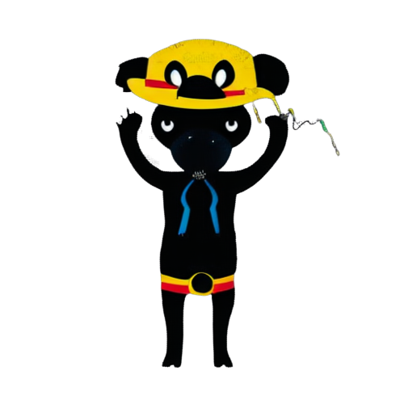

# The main idea 
The collection of data is of utmost importance in Colombia, especially considering the ongoing political and armed conflict in the country. Accurate and reliable data can provide valuable insights into the root causes of the conflict, as well as help track the progress of peace negotiations and the implementation of peace agreements. It can also aid in the development of evidence-based policies and programs aimed at addressing the various issues contributing to the conflict, such as poverty, inequality, and lack of access to education and healthcare. By gathering data on these and other key indicators, it is possible to gain a better understanding of the challenges facing Colombia and work towards finding solutions to address them.
The idea of this project is to make a tool capable of collecting data from different reliable sources in Colombia in order to collect data necessary to analyze the armed conflict in the country and its cultural panorama.
# The reason
It is difficult to know which news outlets are polarized in Colombia since the political landscape is very difficult to interpret, a good solution to do data analysis on Colombian news is to cover as many news outlets as possible.
# The project
This project is done with the purpose of supporting and encouraging the analysis of Colombian data and with this understanding the history of the country from different perspectives, it is a project developed by a data analysis enthusiast, a hacker and a computer science student.
